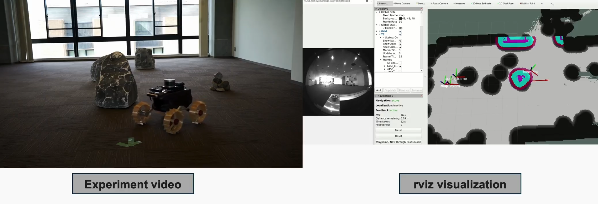

<!-- ---
layout: page
title: Rover revival project
description: Development of system development of lunar rover Moonraker
img: assets/img/project_preview/moonraker_3.png
importance: 2
category: work
giscus_comments: true
---

Robotics project to revive Moonraker rover from past GoogleX LunarPrize in my previous lab (Space Robotics Lab @ Tohoku University). 
I re-designed electronics (power module, distribution board), motor control module (this comes with maxon ESCON motor driver and ESP32), a camera mount (Intel D435i and D455), and ROS2 software (differential motion drive and camera launch scripts). 

 -->
